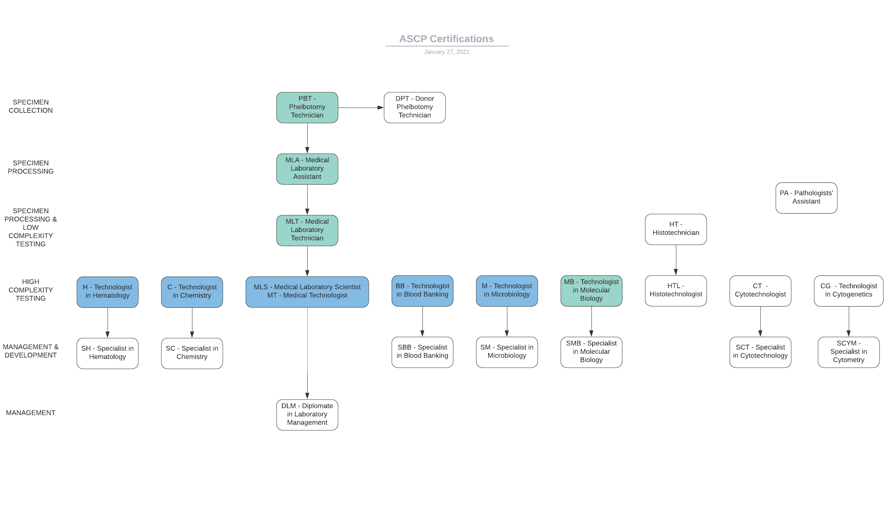

# My Advice on ASCP Certification
### General Information about ASCP Certification
Do you have a bachelor's degree in a life science but are unable to find a job? Does the idea of working in a medical diagnostic laboratory appeal to you? ASCP certification may be a good career path for you. The majority of bachelor's degree holders who work in medical diagnostics laboratories in the US are working as Medical Laboratory Scientists, formerly known as Medical Technologists. These jobs pay between $20 and $40 per hour, depending on what region you work in and your level of experience. Medical Laboratory Scientists carry out testing on blood, urine, other bodily fluids, and tissues collected from a patient. When you go to an urgent care to get a diagnosis of a UTI, when you get your cholesterol levels checked as part of an annual physical, or when you get a nasopharyngeal swab done for COVID-19, your urine, blood, or swab goes to a medical diagnostic laboratory and is processed and tested by people with various levels of ASCP certification. The information presented here is intended to be a general overview of how ASCP certification works and its role in diagnostic laboratories. If you're interested in accurate, up-to-date, specific information on how to get certified, please visit the [ASCP Board of Certification](https://www.ascp.org/content/board-of-certification/get-credentialed). I personally have the M(ASCP) and MB(ASCP) certifications, which I obtained after getting a B.S. in chemistry. If you're interested in reading about how I obtained those or **what my day-to-day job is like as a clinical microbiologist, please visit [this page](worklife.md).**

There are two main areas of ASCP certification, and while there can be crossover between these areas, for the most part there are separate schools and education programs for each of these areas.
##### General Laboratory
This includes phlebotomists who draw blood from patients, clinical/medical laboratory assistants who process specimens, and medical laboratory technicians and scientists who perform testing on specimens. People working in this area of the laboratory may have educational backgrounds anywhere from high school through holding a Ph.D. or M.D. While personnel who process specimens may have a high school, associate's degree, or bachelor's degree educational backround and may not always have an ASCP certification, any personnel who perform actual specimen testing and who report results typically must have some kind of certification to do so, for which ASCP is the most common nationally-recognized certifying body. The common ASCP certifications held by personnel working in a general laboratory may include MLT, MLS, H, C, BB, or M. Larger laboratories or laboratories that offer a wide variety of services or specialties may also employ people with less-common ASCP certifications.
##### Anatomic Pathology
This includes pathologists and their assistants, personnel working in histology, and personnel working in cytology. The majority of the diagnostic testing performed in an anatomic pathology laboratory is related to cancer diagnostics, screening, and staging, but these laboratories also play a role in diagnosing infectious diseases and genetic or other cellular abnormalities. 
### MLS(ASCP) - Medical Laboratory Scientist
This job and its associated certification used to be called Medical Technologist, so you may see older coworkers whose credentials say MT(ASCP). MLS is the newer term but is directly equivalent to MT. You may hear MLS employees referred to as "techs" and this is why. The MLS(ASCP) certification enables you to perform the vast majority of day-to-day tasks in a general medical diagnostics laboratory, from testing specimens and reporting results all the way down to processing and even phlebotomy. An MLS(ASCP) certification provides job security and stability in the long-term, as this is an expanding profession and is not likely to be eliminated by technological advancements, unlike a few of the other laboratory professions. Although new, more efficient technologies come out every year, these instruments still require human management and intervention, and human oversight is still a necessary part of results reporting. Additionally, even though tasks are becoming more and more automated, there is also a higher specimen throughput due to greater availability and affordability of testing and a greater need for testing to support the health issues of our aging population. 
##### How to Get Certified
There are many paths to MLS(ASCP) certification. The three most common paths are bachelor's degrees in MLS, 4+1 post-baccalaureate programs intended for people who already hold a non-MLS bachelor of science, and MLT-to-MLS bachelor's programs intended for people who already hold the MLT(ASCP) certification (which itself is typically granted as part of an associate's degree program). In order for students to be eligible to sit an ASCP board exam after completing one of these programs, the program must be certified by the National Accrediting Agency for Clinical Laboratory Sciences (NAACLS). There are about 120 universities in the United States that offer NAACLS-accredited MLS programs of one of the three types discussed above. You can find a university near you by using the [NAACLS Find-a-Program](https://www.naacls.org/Find-a-Program.aspx) search utility. My personal recommendation would be the programs available at the [University of North Dakota](https://med.und.edu/medical-laboratory-science/). They offer a full bachelor's degree as well as the +1 post-baccalaureate component of the 4+1 route. UND offers many of these classes online or through other distance learning arrangements and their tuition is incredibly cheap, making this an ideal option for students who need to continue working while pursuing their MLS certification. For students who already have a bachelor of science degree, another extremely well-regarded program is the [Mayo Clinic Medical Laboratory Science Program](https://college.mayo.edu/academics/health-sciences-education/medical-laboratory-science-program-florida-and-minnesota/). This program is extremely competitive, but it offers the opportunity to learn from and get experience in one of the most interesting, most cutting-edge clinical laboratories in the country. 
##### Studying for the Board Exam
There are a number of different websites and published books with practice test questions for the general MLS(ASCP) exam. I did not personally care for the BOC Study Guide practice book that is actually published by ASCP, but if you can get a copy of it for free from someone, then certainly use it. The practice test website I used and liked the best was LabCE. However, access to the practice questions costs $75 dollars for one year of use. There is no cheaper monthly option. If this is not within your budget, don't try to force it to be. Over the course of your MLS program, you should retain any flashcards or other materials you've prepared as part of studying for your regular classes. I used an application called [Anki](https://apps.ankiweb.net/) to make and keep all my flashcards, and this application has a built-in spaced repetition mechanism, which helps you cover subjects you're weak at more heavily. I have also compiled some brief notes for my coworkers who are planning to take the test [here](studyguide.md).
### M(ASCP) - Technologist in Microbiology
The M(ASCP) certification enables you to work at the same level as a Medical Laboratory Scientist (MLS) or Medical Technologist (MT) ASCP certification, but only within a microbiology department. 
##### How to Get Certified
If you have a Bachelor of Science degree in chemistry, biology, or another "life science," and you have taken at least 30 semester units of chemistry and biology courses, you are eligible for M(ASCP) certification programs. An NAACLS-accredited certification program will cover the microbiology component of the full MLS certification program. It will also contain a rotation in a microbiology department as part of the curriculum. University of North Dakota has categorical certifications available in microbiology, hematology, chemistry, and blood banking. 
##### Studying for the Board Exam
I used LabCE and my own flashcards to study for this exam, as mentioned previously. LabCe has an option to select just a particular area of study, so I would generate practice tests using only microbiology or only microbiology and general lab operations/safety questions. 
### MB(ASCP) - Technologist in Molecular Biology
The MB(ASCP) certification enables you to work at the same level as a Medical Laboratory Scientist (MLS) or Medical Technologist (MT) ASCP certification, but only within a molecular biology department. Not all laboratories have a separate molecular biology department. Some laboratories may have a separate virology & other infectious disease molecular biology department, and such departments may require MB(ASCP) certification rather than MLS(ASCP) certification.
##### How to Get Certified
If you have a Bachelor of Science degree in chemistry, biology, or another "life science," and you already have any of the other main technologist-level certifications such as the MLS, M, C, H, or BB certifications, you are eligible to take the MB(ASCP) certification exam. 
##### Studying for the Board Exam
Unlike the MLS or other main certifications, there aren't really dedicated practice question books or websites for this certification. ASCP publishes a study guide for this exam which is a brief outline of the topics covered, but it isn't particularly informative. ASCP also lists several textbooks they recommend for studying for this exam, one of which was a textbook I already had from my molecular diagnostics course. I skimmed this textbook and went through my molecular diagnostics course flashcards in order to prepare for this exam. In my opinion this exam is not particularly challenging if you are capable of passing the M(ASCP) exam. I felt like roughly 40% of the material covered had a direct crossover with the material you need to know for the M(ASCP) regarding infectious diseases/laboratory operations and safety/how various PCR and sequencing methods work, and the rest was about human genetics and associated diseases. I spent maybe ten total hours on review of any kind for this exam and still passed, so if you already have your MLS(ASCP) or M(ASCP) certification, I would recommend taking this exam if you're interested in career advancement opportunities in the molecular biology area of the lab.
###### Last updated 27 January 2021
